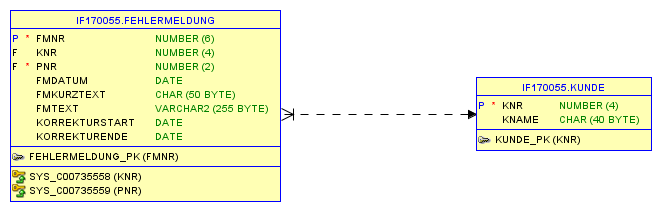
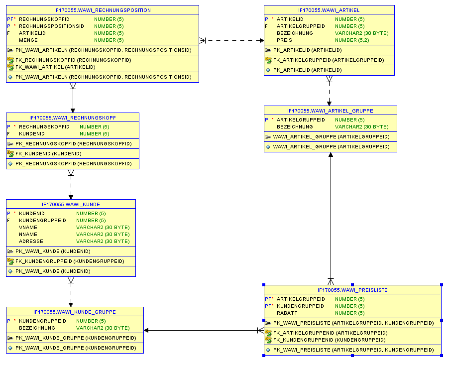

= Apex Tutorial

== Tree

=== Fehlermeldungen

.ERD

.SQL Code
[source, sql]
----
select * from ( -- <1>

   select 1 as status, -- <2>
   1 as einrueck,
   'Fehlermeldungen' as title,
   null as icon,
   0 as value,
   null as tooltip,
   null as link from dual

union

select -1 as status, -- <3>
    2 as einrueck,
    kname as title,
    null as icon,
    knr as value,
    null as tooltip,
    null as link
    from kunde k
    where exists (select * from fehlermeldung f where k.knr = f.knr)

union

select 0 as status, -- <5>
   3 as einrueck,
   fmtext as title,
   null as icon,
   knr as value,
   null as tooltip,
   apex_util.prepare_url('f?p='||:app_id||':1:'||:app_session||':T:::P1_FMNR:' || fmnr) as link
from fehlermeldung

union

select 0 as status, -- <4>
    2 as einrueck,
    kname as title,
    null as icon,
    knr as value,
    null as tooltip,
    null as link
    from kunde k
    where not exists (select * from fehlermeldung f where k.knr = f.knr)

) order by value, einrueck
----

*1.* Die erste Zeile ist immer ein Select was auf das "große" Select geht. Es wird verwendet, um zum Schluss es dann zu sortieren für den Parser.

[source, sql]
----
select * from ( /* sql statement */) order by value, einrueck
----

*2.* Als erstes wird der Stamm Selected

[source,sql]
----
select 1 as status,
   1 as einrueck,
   'Fehlermeldungen' as title,
   null as icon,
   0 as value,
   null as tooltip,
   null as link from dual
----

*3.* nach einem ``union`` folgt dann der Ast. Wichtig ist die letzte Zeile. Diese sagt aus ob nach dem Ast noch was kommt.
Würde da ein ``not exists`` stehen, müssten wir in der ersten zeile 0 statt -1 schreiben. (Es ist dann kein Ast mehr sondern ein Blatt)

[source,sql]
----
select -1 as status,
    2 as einrueck,
    kname as title,
    null as icon,
    knr as value,
    null as tooltip,
    null as link
    from kunde k
    where exists (select * from fehlermeldung f where k.knr = f.knr)
----

*4.* Bsp für ``not exists``

[source,sql]
----
select 0 as status,
    2 as einrueck,
    kname as title,
    null as icon,
    knr as value,
    null as tooltip,
    null as link
    from kunde k
    where not exists (select * from fehlermeldung f where k.knr = f.knr)
----

*5.* Zum schluss kommt noch das Blatt. Das hat dann meistens einen Link.

[source,sql]
----
select 0 as status, -- <4>
   3 as einrueck,
   fmtext as title,
   null as icon,
   knr as value,
   null as tooltip,
   apex_util.prepare_url('f?p='||:app_id||':1:'||:app_session||':T:::P1_FMNR:' || fmnr) as link
from fehlermeldung
----

IMPORTANT: Die Reihenfolge ist nicht wichtig so lang zum schluss ein Order by kommt

=== WAWI

[source,sql]
----
select * from (
   select 1 as status,
   1 as einrueck,
   'WAWI' as title,
   null as icon,
   0 as value,
   null as tooltip,
   null as link from dual

union

select -1 as status,
    2 as einrueck,
    (select k.vname from WAWI_KUNDE k where k.kundenid = r.kundenid),
    null as icon,
    r.rechnungskopfid as value,
    null as tooltip,
    null as link
    from WAWI_RECHNUNGSKOPF r

union

select 0 as status,
   3 as einrueck,
   (Select a.bezeichnung from WAWI_ARTIKEL a where a.Artikelid = r.artikelid),
   null as icon,
   rechnungskopfid as value,
   null as tooltip,
   null as link
from WAWI_RECHNUNGSPOSITION r

) order by value, einrueck
----
